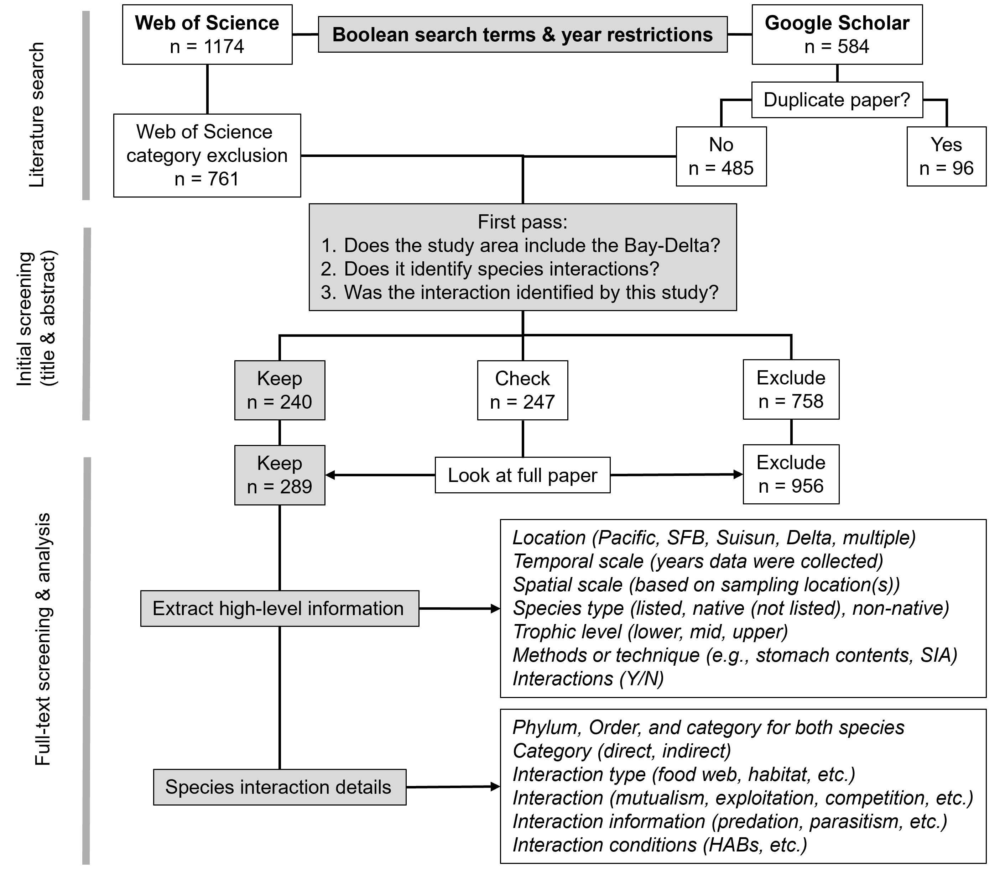

# species_interactions_main

Main repository for analysis of species interactions in the Bay-Delta Estuary.

## Project Description

This project is a structured literature review of species interactions in the San Francisco Bay 
and Sacramento-San Joaquin Delta (hereafter Bay-Delta), with a focus on food web interactions. 
The objectives of this project were to:

1.  Understand the spatial spread of science conducted on food web interactions in the Bay-Delta

2.  Determine the science gaps; are more studies completed on native, non-native, or particular species?

3.  Determine what types of species interactions are studied and whether there are overlooked connections for the management of species.

### Methods

This project used a structured literature review, searching Web of Science and 
Google Scholar with fixed, boolean search strings (see Fig. 1). The search was 
restricted to more recent papers, from January 1, 1990-June 23, 2023. After category 
and paper language exclusions, \~1200 papers were examined for the initial screening 
(titles and abstracts). Papers that fit all 3 criteria (Fig. 1) went through full 
text screening and species interactions from the study were pulled out. This review followed
the Preferred Reporting Items for Systematic Reviews and Meta-Analyses (PRISMA) format for reproducibility
([Moher et al., 2009](https://pubmed.ncbi.nlm.nih.gov/19621072/); adapted for ecology by [Lodi et al., 2021](https://api.semanticscholar.org/CorpusID:233803309)).

Figure 1. PRISMA diagram for structured literature review, showing paper retention and eliminations
at all stages of the analysis.

### Results

For results of this project, please visit the Shiny app showing food web interactions [here.](https://reclamation-bdo-science.shinyapps.io/Species_Interactions/)

This project is still a work in progress. Thank you for visiting!